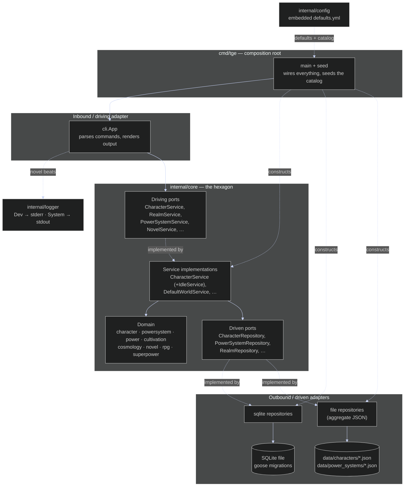

# Hexagonal Architecture

The application is **Ports and Adapters**: every dependency points *inward* toward
the domain. The CLI (inbound adapter) only ever calls **driving ports** — interfaces
like `port.CharacterService` — never a concrete service. Those ports are implemented
by the **service** layer, which orchestrates the pure **domain** and reaches storage
only through **driven ports** like `port.CharacterRepository`.

There are **two** driven adapter families behind those ports. `adapter/sqlite` backs the
row-shaped entities (realms and levels, the cosmology tiers, timelines, species, novels
and the whole RPG catalogue), opening the database through `open(dsn)` which applies
embedded goose migrations. `adapter/file` backs the two aggregate-shaped entities —
`Character` and `PowerSystem` — as single JSON documents, because a character's unlocked
nodes / idle slots / mechanic state and a system's whole DAG are object graphs, not rows.
Swapping either one is invisible to the core: that substitutability is the point of the
port. See [../decisions.md](../decisions.md) §3.

The one place that knows about concrete types is `cmd/tge`, the **composition root**,
which loads the embedded defaults, opens the database, constructs both repository
families, injects them into the services, seeds the starter catalog idempotently, and
hands the services to the CLI. This inversion is what lets the entire CLI be exercised
with in-memory fakes (no process or storage) and lets the domain stay ignorant of SQLite,
goose, JSON and flags.
