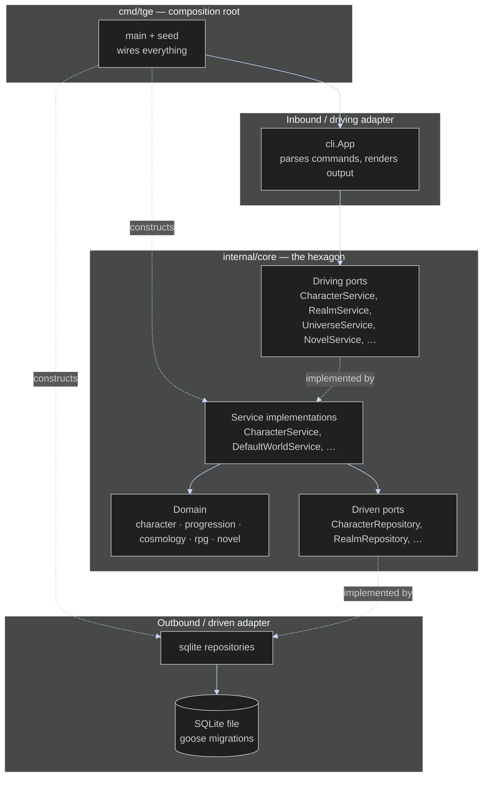

# Hexagonal Architecture

The application is **Ports and Adapters**: every dependency points *inward* toward
the domain. The CLI (inbound adapter) only ever calls **driving ports** — interfaces
like `port.CharacterService` — never a concrete service. Those ports are implemented
by the **service** layer, which orchestrates the pure **domain** and reaches storage
only through **driven ports** like `port.CharacterRepository`. The SQLite adapter
implements those driven ports. The one place that knows about concrete types is
`cmd/tge`, the **composition root**, which opens the database, constructs the SQLite
repositories, injects them into the services, and hands the services to the CLI. This
inversion is what lets the entire CLI be exercised with in-memory fakes (no process or
storage) and lets the domain stay ignorant of SQLite, goose, and flags.
