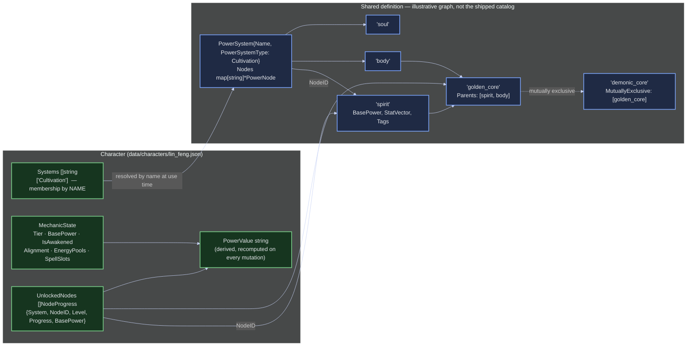

# A Character's Power: Shared Definition vs. Held Progress

> The graph above is drawn to show what the DAG *can* express. The seeded `Cultivation`
> system is actually flat — three parentless roots (`spirit`, `body`, `soul`) and no edges
> at all; `golden_core`/`demonic_core` are invented. The only seeded system with real parent
> edges is `SuperPower`, whose five category roots each have children. Nothing in the
> shipped catalog uses `EdgeSibling` or `EdgeMutuallyExclusive`.

A `PowerSystem` is a **shared definition** and holds no per-character state whatsoever.
It is a DAG of `PowerNode`s in a flat `map[string]*PowerNode` keyed by a slug ID derived
from the node name, with shape carried by edges *on the nodes*: `Parents` (multi-parent —
`golden_core` needs both `spirit` and `body`), `Siblings`, and `MutuallyExclusive` (written
symmetrically onto both nodes). A parent edge that would close a cycle is rejected with
`ErrCyclicDependency`, which is what keeps it a DAG rather than a general graph.

The **character** holds three separate things pointing at that definition:

- `Systems []string` — membership, by name. The definition is loaded from the repository
  when it's actually needed.
- `MechanicState` — everything true about the character *across* systems: tier, awakening,
  alignment, energy pools, spell slots, vows, permanent traits. Stored once, not
  duplicated per system.
- `UnlockedNodes []NodeProgress` — a short list of `{System, NodeID, Level, Progress,
  BasePower}` records for the individual nodes it has actually unlocked.

`PowerValue` is not stored state but a rendered derivation, recomputed by
`CalculateTotalPower()` on every mutation:
`(MechanicState.BasePower + Σ node.BasePower × node.Level) × Π species.Power`, floored at
`1.0`. Note the product over **all** species — that's what makes hybrids compound.

This replaced an earlier design where a character carried two `[]PowerSystem` fields —
tree *definitions* and progressed *instance* copies with state hung on each node. That
duplicated the whole tree per character to annotate a few nodes. See
[../decisions.md](../decisions.md) §1–§2 for the full rationale.
