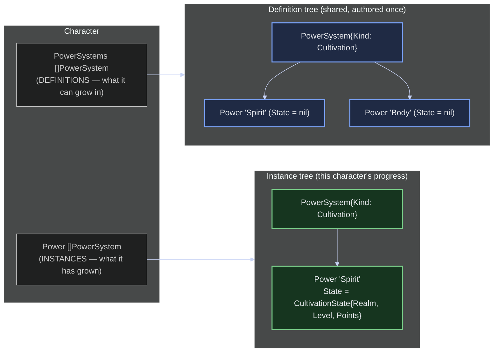

# A Character's Power: Definition vs. Instance

A `Character` carries **two** `[]progression.PowerSystem` fields that use the same type
for two different jobs. `PowerSystems` are the **definitions** — the complete power
trees the character has access to, authored once and shared; their `Power` nodes carry
no state (`State == nil`). `Power` is the character's **instances** — its own progressed
copies, where each node it has advanced carries a `PowerState`. Keeping both as
`PowerSystem` (rather than a cultivation-specific type) is deliberate: `SystemKind`
distinguishes families (`Cultivation`, `Magic`), and the node-level `PowerState`
interface lets each family bring its own progress shape. Today the only implementation
is `CultivationState` (Realm + Level + accumulated Points + Progress), so a cultivation
instance node reads "at *this* Realm and Level"; a future Magic system would attach a
different `PowerState` to the same structure. `PowerValue` (a rendered string) is a
separate, third thing — a summary number, not the structured state. See
[../decisions.md](../decisions.md) §1–§2 for the rationale.
