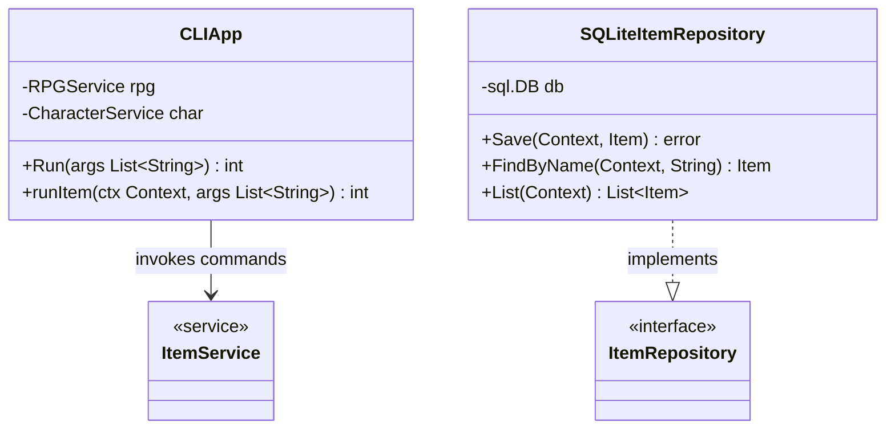

# Adapters Diagram

This diagram visualizes the external adapter layers implementing the core application interfaces. 
- The **CLI Adapter** translates terminal user inputs into domain structures and triggers Services.
- The **SQLite Adapter** implements the Core Driven Ports (Repositories) to persist the domain state to disk.

