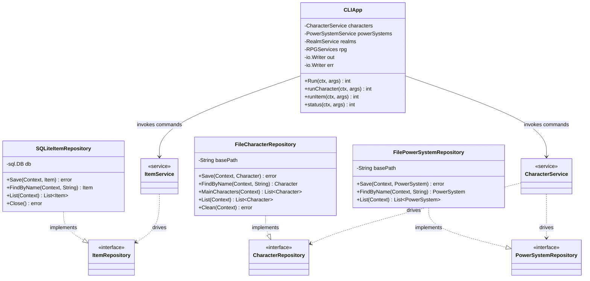

# Adapters Diagram

This diagram visualizes the external adapter layers implementing the core application
interfaces.

- The **CLI Adapter** (driving) translates terminal input into port inputs and renders results.
- The **SQLite Adapter** (driven) persists row-shaped entities via embedded goose migrations.
- The **File Adapter** (driven) persists the two aggregate-shaped entities — `Character` and
  `PowerSystem` — as single JSON documents.

The SQLite repositories are the wide default — one per entity, each opening the database
through `open(dsn)` (which runs pending goose migrations) and each exposing `Close`. The
`file` repositories carry no handle to close: `Save` marshals the aggregate with
`json.MarshalIndent`, writes to `<slug>.json.tmp`, and `rename`s it into place so a save is
atomic. `FindByName`/`List` re-initialise nil maps and slices after decoding (`UnlockedNodes`,
`MechanicState.EnergyPools`, `PowerSystem.Nodes`) so callers never see a nil map. `Clean`
soft-deletes by renaming to `.deleted` rather than unlinking.

The filename is a slug of the entity name (lowercased, spaces → `_`, `filepath.Base` applied
to defeat traversal), so names differing only in case or spacing map to the same file.
`CreateCharacter` works around this by appending `" (1)"`, `" (2)"`, … until the slug is free.

Both adapter families are wired in `cmd/tge/main.go`, the only place that knows a concrete
type. See [../decisions.md](../decisions.md) §3 for why the split exists.
