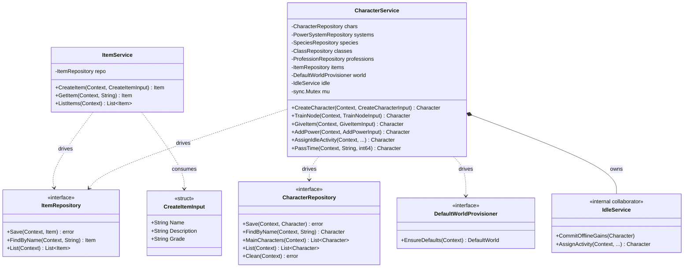

# Core Ports & Services Diagram

This diagram visualizes the Hexagonal Architecture pattern used to separate driving logic
(Services) from driven logic (Repositories) inside the core. The RPG `Item` slice is shown
as the reference shape — most catalogue entities repeat it verbatim — alongside
`CharacterService`, which shows what a service looks like once it spans several ports.

The catalogue entities (ability, skill, item, effect, equipment, profession, class, quest,
recipe) each get a hand-written service and repository of the same shape; the **CLI** side
is where the repetition is actually collapsed, by the generic
`runSimpleRPGCommand[T]` helper in `adapter/cli/rpg.go`.

`CharacterService` shows the two ways a service grows beyond one port. It depends on
several **driven** ports (it validates a class/profession/item/species exists before
using it, and loads a power system to validate a node), and on another **driving** port —
`DefaultWorldProvisioner`, implemented by `DefaultWorldService` — to provision the default
cosmology when a main character is created. Dependencies still point inward: it names
interfaces, never `adapter/file` or `adapter/sqlite`.

`IdleService` is deliberately **not** a port. It is an internal collaborator constructed by
`NewCharacterService`; idle use cases reach the outside world through `CharacterService`'s
own interface. `CharacterService` also guards its mutating methods with a `sync.Mutex`,
since read-modify-write over a whole JSON aggregate is not atomic on its own.
