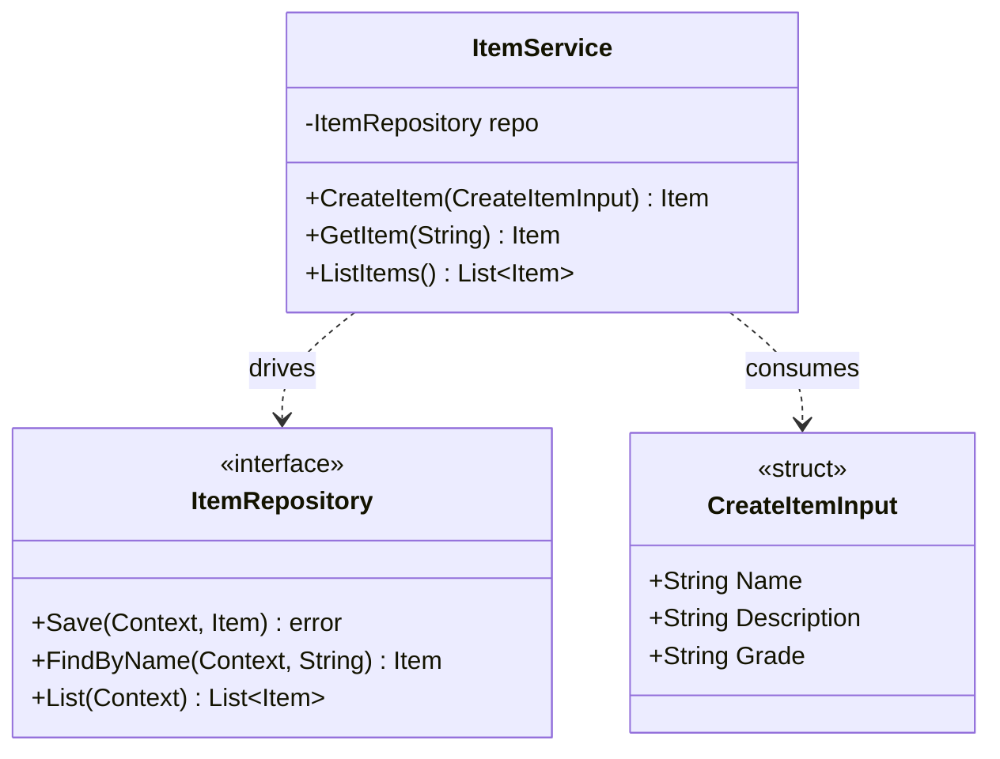

# Core Ports & Services Diagram

This diagram visualizes the Hexagonal Architecture pattern used to separate driving logic (Services) from driven logic (Repositories) inside the core domain. Note that this pattern is replicated identically across all domain models via Generics, but mapped out here using the RPG `Item` as a reference.

