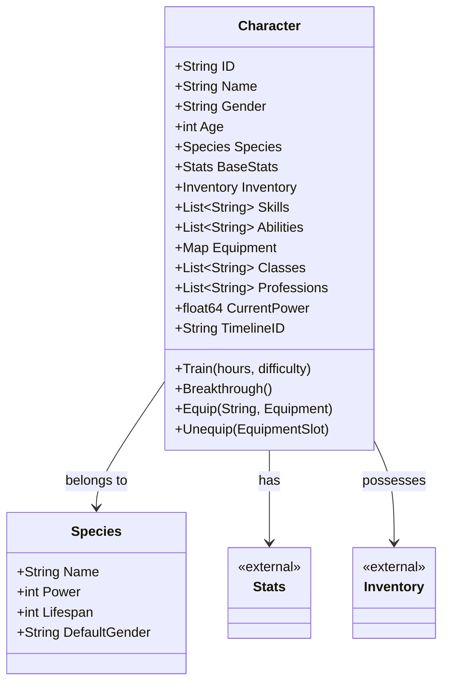

# Character Domain Class Diagram

This diagram shows the composition of a Character inside `internal/core/domain/character`. It integrates with `rpg`, `progression`, and `cosmology`.

```mermaid
classDiagram
    class Character {
        +String ID
        +String Name
        +String Gender
        +int Age
        +Species Species
        +Stats BaseStats
        +Inventory Inventory
        +List~String~ Skills
        +List~String~ Abilities
        +Map Equipment
        +List~String~ Classes
        +List~String~ Professions
        +float64 CurrentPower
        +String TimelineID
        +Train(hours, difficulty)
        +Breakthrough()
        +Equip(String, Equipment)
        +Unequip(EquipmentSlot)
    }
    
    class Species {
        +String Name
        +int Power
        +int Lifespan
        +String DefaultGender
    }
    
    class Stats {
        <<external>>
    }
    
    class Inventory {
        <<external>>
    }

    Character --> Species : belongs to
    Character --> Stats : has
    Character --> Inventory : possesses
```
