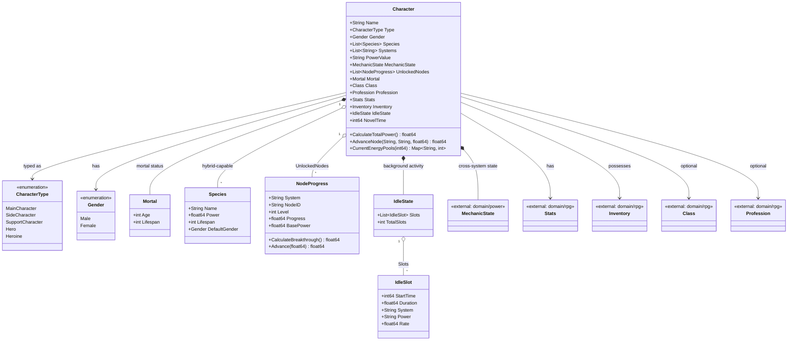

# Character Domain Class Diagram

This diagram shows the composition of a Character inside `internal/core/domain/character`.
It integrates with `rpg` (Class, Profession, Stats, Inventory) and `power`
(`MechanicState`), and references `powersystem` **by name/ID only** — a character never
embeds a power system.

`NewMortalCharacter` defaults age to `16` when unset, stats to `rpg.BaseStats()` (`0.65`
across the board), `MechanicState` to tier `0` / `BasePower 1.0`, and `IdleState.TotalSlots`
to `1`, then computes `PowerValue`. `CheckRole` enforces the cross-character rules: a
`Hero` requires a **female** main character to already exist, a `Heroine` a **male** one.

`CalculateTotalPower()` is
`(MechanicState.BasePower + Σ node.BasePower × node.Level) × Π species.Power`, floored at
`1.0` and rendered into `PowerValue`. `NodeProgress.CalculateBreakthrough()` is the gate
for the current level, `100 × Level²`; `Advance` pours points in, levels up when the gate
fills, and returns the unconsumed remainder.

The whole struct is serialized as one JSON document (`data/characters/<slug>.json`), so
every field here — including the multi-species list and the idle slots — round-trips.
