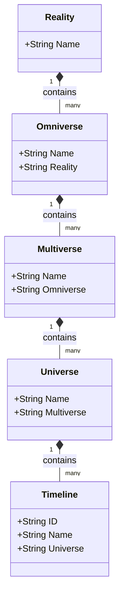

# Cosmology Domain Class Diagram

This diagram models the hierarchy of existence inside `internal/core/domain/cosmology`. The system scales from a foundational Reality down to specific alternative Timelines.

