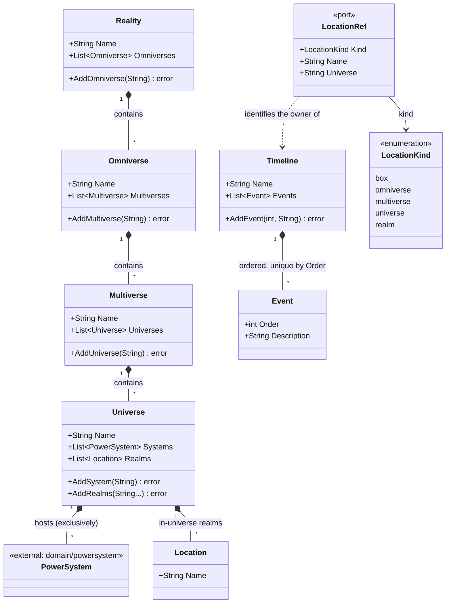

# Cosmology Domain Class Diagram

This diagram models the hierarchy of existence inside `internal/core/domain/cosmology`.
Containment is **downward and by value**: each tier holds a slice of its children, and
children are added *by name* (`AddOmniverse`, `AddMultiverse`, `AddUniverse`) with
duplicates rejected. No child carries a back-reference to its parent.

`Location` is a "realm" in the **in-universe** sense — a named place inside a universe
("Mortal Realm", "Heaven Realm"). It is unrelated to `cultivation.Realm`, which is a
*power* stage with `ax + b` formulas; they merely share the word. A universe may hold zero
realms, exactly one (a "bubble"), or many.

A `Timeline` is **not** owned by a struct pointer. Every location at every tier — Reality
(the Box), Omniverse, Multiverse, Universe and each in-universe Location — owns exactly one
timeline, addressed through `port.LocationRef` (kind + name). A realm also carries its
`Universe`, because realm names are unique only within a universe; the other kinds are
globally unique. Events are unique by `Order` within a timeline and kept sorted ascending.

Timelines are authored narrative events. They are a different clock from
`Character.NovelTime`, which is the simulation clock idle progression runs against.
