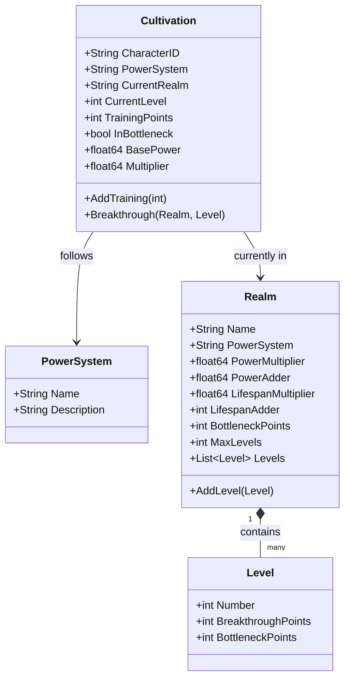

# Progression Domain Class Diagram

This diagram maps out the cultivation and progression system within `internal/core/domain/progression`.

```mermaid
classDiagram
    class PowerSystem {
        +String Name
        +String Description
    }
    
    class Realm {
        +String Name
        +String PowerSystem
        +float64 PowerMultiplier
        +float64 PowerAdder
        +float64 LifespanMultiplier
        +int LifespanAdder
        +int BottleneckPoints
        +int MaxLevels
        +List~Level~ Levels
        +AddLevel(Level)
    }

    class Level {
        +int Number
        +int BreakthroughPoints
        +int BottleneckPoints
    }
    
    class Cultivation {
        +String CharacterID
        +String PowerSystem
        +String CurrentRealm
        +int CurrentLevel
        +int TrainingPoints
        +bool InBottleneck
        +float64 BasePower
        +float64 Multiplier
        +AddTraining(int)
        +Breakthrough(Realm, Level)
    }

    Realm "1" *-- "many" Level : contains
    Cultivation --> PowerSystem : follows
    Cultivation --> Realm : currently in
```
