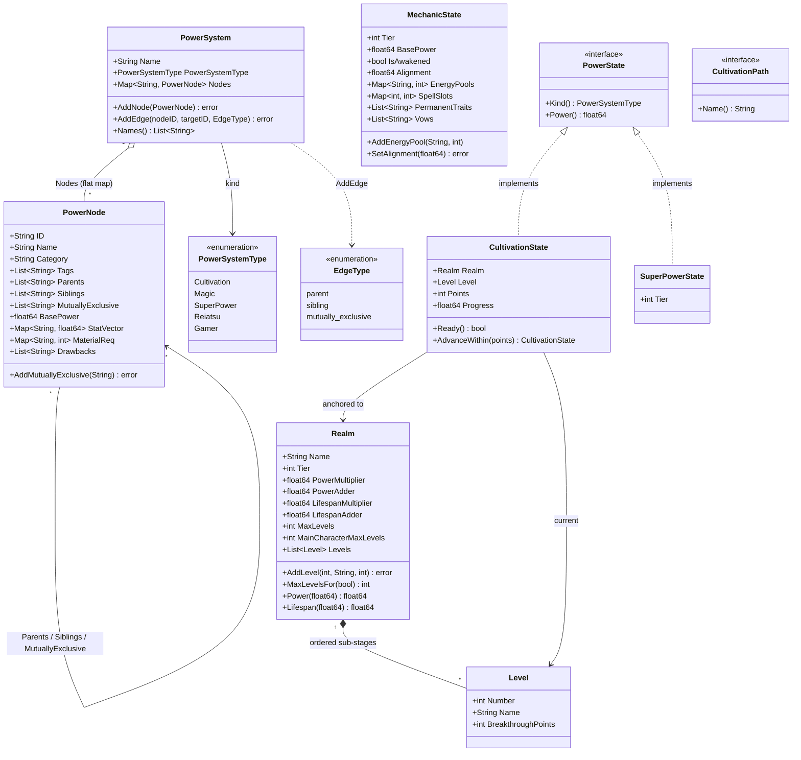

# Progression Domain Class Diagram

Progression is split across three packages under `internal/core/domain`:

- `powersystem` — the shared DAG definition (`PowerSystem`, `PowerNode`).
- `power` — the character-level `MechanicState` and the `PowerState` interface.
- `cultivation` — the realm/level model and `CultivationState`.

The **shipped** progression path is `character.NodeProgress` against a `PowerNode`.
`cultivation` and `superpower` are staged but not wired to any service — see
[../decisions.md](../decisions.md) §5.

`PowerSystem.AddEdge` with `EdgeParent` runs a DFS up the parent chain and returns
`ErrCyclicDependency` if the edge would close a cycle; an `EdgeMutuallyExclusive` edge is
written onto **both** nodes. `PowerNode.ID` is a slug of the name (lowercase, spaces → `_`).

`Realm` uses linear `ax + b` formulas for both power and lifespan, evaluated at a
progress value `x`. `MaxLevelsFor(isMain)` returns the main character's higher cap when
one is set, and `AddLevel` rejects a level number above the realm's *effective* cap (the
higher of the two), so a realm never defines more levels than the most privileged
character could reach. `CultivationState.AdvanceWithin` fills the current level's
breakthrough gate, breaks through level by level, and hands back any points left over once
the realm's last level is full so the caller can carry them into the next realm.

`CultivationPath` (`BodyCultivation`, `SpiritCultivation`, `SoulCultivation`) is an open
interface rather than an enum so each path can accrue its own attributes and items
without forcing changes on what references it (OCP). It is currently unreferenced.
