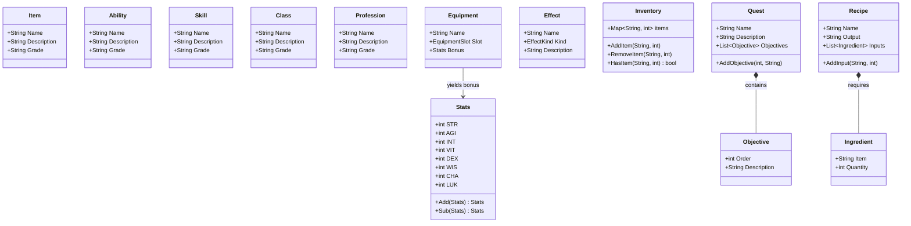

# RPG Domain Class Diagram

This diagram maps out the core RPG entities that exist inside `internal/core/domain/rpg`. They represent standard definitions of objects, skills, and mechanics within the game world.

