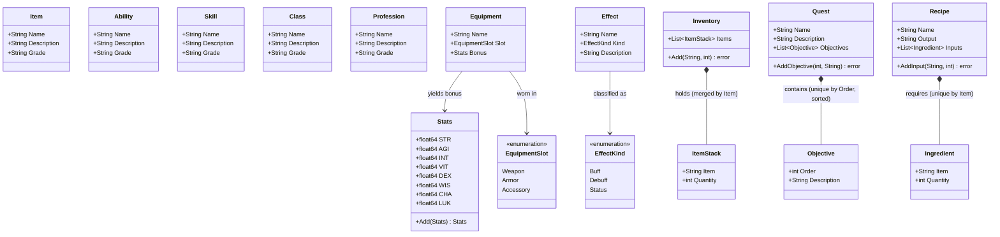

# RPG Domain Class Diagram

This diagram maps out the core RPG entities that exist inside `internal/core/domain/rpg`.
They represent standard definitions of objects, skills, and mechanics within the game
world. Every identity-bearing entity is keyed by `Name`; `Stats` and `Inventory` are
components of a `Character` rather than standalone entities.

Stats are `float64`, not integers, and `BaseStats()` starts a character at `0.65` across all
eight attributes (`defaults.yml` sets the same `0.65` for `character.stats`, and that config
value is what `CharacterService` actually passes — `BaseStats()` is only the domain-level
fallback). Only `Add` exists (there is no `Sub`); it is used for base + equipment bonus.
`NewStats` rejects a negative attribute.

`Inventory` is a slice of `ItemStack`, not a map: `Add` merges into an existing stack for
the same item and rejects a blank item or a non-positive quantity. `Quest.AddObjective`
keeps objectives sorted by `Order` and rejects a duplicate order; `Recipe.AddInput`
rejects a duplicate ingredient item.

`Grade` is a free-form string on Item/Ability/Skill/Class/Profession. `defaults.yml`
defines a Common → Mythic ladder with `power_multiplier`s, but nothing consumes it yet and
the seeder does not pass catalog grades through — see
[../decisions.md](../decisions.md) §9.
