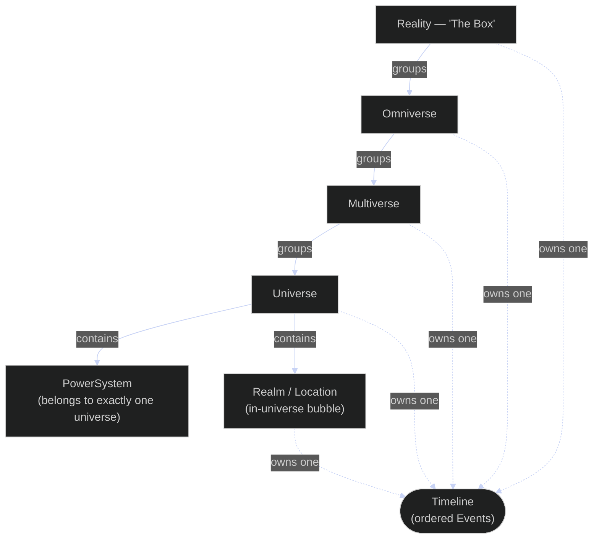

# Cosmology & Timelines

The world is a strict **containment hierarchy**: a `Reality` (the "Box") groups
`Omniverse`s, which group `Multiverse`s, which group `Universe`s. Membership is by
name and each child belongs to at most one parent (an omniverse to one reality, and so
on). A `Universe` is where the game mechanics live: it contains one or more
`PowerSystem`s (each system belongs to exactly one universe) and in-universe `Realm`s
(locations/bubbles — distinct from the *cultivation* realms of the progression model).
Every location at every tier — Reality, Omniverse, Multiverse, Universe, and each
in-universe Realm — **owns exactly one `Timeline`**, an ordered, uniquely-numbered
sequence of `Event`s, auto-provisioned with a derived default name when the location is
created. A universe may hold zero realms, exactly one (a "bubble"), or many.

A Timeline holds **authored narrative events**. It is a different clock from
`Character.NovelTime`, the per-character simulation clock that idle progression runs
against — see [progression-flow.md](progression-flow.md).

Creating a name-only main character provisions this whole chain once, idempotently; that
flow is in [create-character-flow.md](create-character-flow.md). Note that adding a realm
(`Location`) to a universe has a domain method, port and service — but **nothing calls the
service method**: there is no CLI command, and the default-world provisioner writes its one
realm through the repository's `SaveRealms` directly. `UniverseService.AddRealms` (and the
realm-timeline provisioning inside it) is unreachable today.
