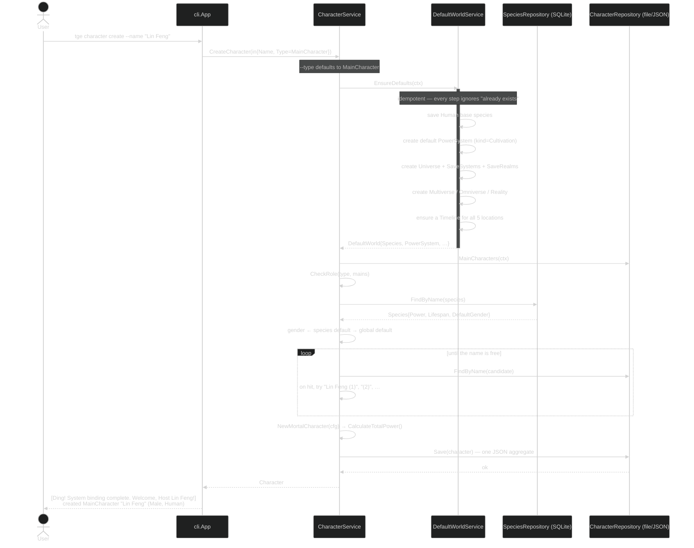

# Flow: Create a (name-only) Main Character

Creating a character from **just a name** is the marquee flow. `CreateCharacter`
recognises the (defaulted) `MainCharacter` type and asks `DefaultWorldService` to
provision the default cosmology — the Human base species, a default power system of kind
`Cultivation` (named by `world.power_system` in `defaults.yml`, shipped as `"Cultivation"`;
the in-code fallback is `"Mortal Path"`), and the full `Reality → Omniverse → Multiverse →
Universe → Realm` chain with a timeline for each — **idempotently**, so repeated creations
converge on one shared world.

`CreateCharacter` then fills the blanks: species → the default world's Human base, gender →
the species' `DefaultGender`, then the global default from `defaults.yml`. It resolves the
optional `--class` / `--profession` against their repositories (failing if they don't
exist), enforces the cross-character role rules (`CheckRole` — a `Hero` needs a female main
character, a `Heroine` a male one), and builds a fresh **mortal** via `NewMortalCharacter`
(age 16, `BaseStats()` at 0.65, `MechanicState` tier 0 / BasePower 1.0, one idle slot),
which computes `PowerValue` before returning.

Two behaviours worth noting:

- **Names never collide, they suffix.** Because the file adapter derives a filename from a
  slug of the name, `CreateCharacter` loops `FindByName` and appends `" (1)"`, `" (2)"`, …
  until the slug is free rather than returning "already exists".
- **The character is not joined to the default system.** `Systems` only contains whatever
  `--system` passed; the provisioned default power system is created but not attached.
  Use `tge character add-power` to join one.

The result is a mortal with no `UnlockedNodes` — it hasn't trained yet. Progression is the
next flow, [progression-flow.md](progression-flow.md).
