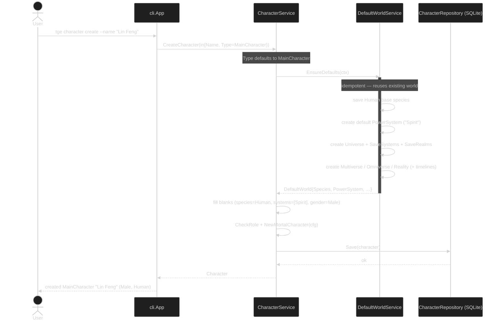

# Flow: Create a (name-only) Main Character

Creating a character from **just a name** is the marquee flow. `CreateCharacter`
recognises the (defaulted) `MainCharacter` type and asks `DefaultWorldService` to
provision the default cosmology — Human base species, the default "Spirit" power
system, and the full `Reality → Omniverse → Multiverse → Universe → Realm` chain with
their timelines — **idempotently**, so repeated creations reuse one shared world.
`CreateCharacter` then fills any unset fields from that default world (species → Human,
systems → `[Spirit]`, gender → the species/global default), enforces the cross-character
role rules (`CheckRole`, e.g. a Hero needs a female main character), builds a fresh
**mortal** character via `NewMortalCharacter`, and persists it. The result is a mortal
with `Power` (instances) empty — it hasn't cultivated yet. Adding cultivation is the
next flow, [cultivate-flow.md](cultivate-flow.md).
