# Flow: Cultivate, then Render Status

```mermaid
%%{init: {"theme":"dark","themeVariables":{"lineColor":"#c8d3f5"},"themeCSS":".edgePath path,.flowchart-link{stroke-width:2px} .messageLine0,.messageLine1{stroke-width:2px} .relation{stroke-width:2px} .actor{stroke-width:2px} .node rect,.node circle,.node polygon,.node path{stroke-width:2px} .cluster rect{stroke-width:2px}"}}%%
sequenceDiagram
    actor User
    participant CLI as cli.App
    participant RS as RealmService
    participant CS as CharacterService
    participant Repo as CharacterRepository (SQLite)

    rect rgb(31,42,68)
    note over User,Repo: tge character cultivate --name "Lin Feng" --realm "Spirit Gathering" --level 2
    User->>CLI: cultivate --name --realm --level
    CLI->>RS: resolveRealm(name) / GetRealm
    RS-->>CLI: Realm{Name, Levels}
    CLI->>CLI: levelByNumber(realm, 2) → Level
    CLI->>CS: Cultivate(in{Character, Realm, LevelNumber, LevelName})
    note over CS: System defaults to first PowerSystem<br/>Path defaults to System name
    CS->>Repo: FindByName (resolve defaults)
    CS->>Repo: SaveCultivation(character, CultivationRecord)
    Repo-->>CS: ok (upsert into character_cultivations)
    CS->>Repo: FindByName → reloaded Character
    CS-->>CLI: Character
    CLI-->>User: Lin Feng now cultivating in Spirit Gathering, Second Level
    end

    rect rgb(22,53,31)
    note over User,Repo: tge status
    User->>CLI: status
    CLI->>CS: MainCharacter(ctx)
    CS->>Repo: MainCharacters + loadCultivations
    Repo-->>CS: Character{Power: [PowerSystem{Powers:[Power{State: CultivationState}]}]}
    CS-->>CLI: Character
    CLI->>CLI: writePowerState() walks Power tree
    CLI-->>User: Power:<br/>  - Cultivation:<br/>    - Spirit: Realm/Level
    end
```

Cultivation is a two-command story that crosses separate processes, so it must
persist. On `cultivate`, the **CLI** resolves the realm and level (via `RealmService`)
into concrete names and calls `CharacterService.Cultivate`. The service defaults the
`System` to the character's first power system and the `Path` to that system's name,
then upserts one row into `character_cultivations` via `SaveCultivation` and returns the
reloaded character. On a later `status`, the repository's `loadCultivations` rebuilds
`Character.Power` from those rows — grouping them into `PowerSystem` instances whose
nodes carry a `CultivationState` — and the CLI's `writePowerState` walks that tree to
render the `Power:` block. Note what the shipped `Cultivate` does and does **not** do:
it *sets* state at a target realm/level; it does not yet accumulate points or trigger
breakthroughs (the growth-rate mechanics remain pending — see
[../decisions.md](../decisions.md) §4).
