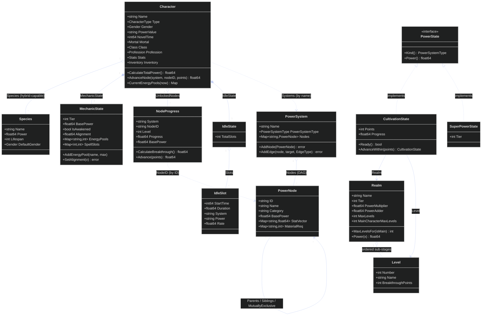

# Domain Model

> Slice/collection fields are shown with `*` multiplicity on the relationships
> rather than `[]` in the boxes (Mermaid class members don't take Go's `[]T`).

The center of gravity is the **Character**. Its power is held in three parts: a
character-level `MechanicState` (tier, awakening, alignment, energy pools, spell slots —
the facts that are true across *every* system it participates in), a list of
`NodeProgress` records naming individual nodes it has unlocked, and `Systems []string`
— membership by name only. The power systems themselves are **shared definitions** that
carry no per-character state: a `PowerSystem` is a **DAG** of `PowerNode`s held in a flat
ID-keyed map, where shape comes from edges on the nodes (`Parents`, `Siblings`,
`MutuallyExclusive`) and a parent edge is rejected if it would close a cycle. Multi-parent
and mutual exclusion are exactly what a tree could not express.

`PowerValue` is a pure derivation — `(MechanicState.BasePower + Σ node.BasePower × Level)
× Π species.Power` — recomputed on every mutation, and **every** species multiplies in,
which is what makes hybrids compound. `IdleState` drives background progression against
`NovelTime`, the character's own in-story clock (see
[progression-flow.md](progression-flow.md)).

`Realm`/`Level` and the `PowerState` implementations (`CultivationState`,
`SuperPowerState`) are the **staged** progression model: authored by `tge realm`, but not
wired to any service — the shipped path is `NodeProgress`. `cultivation` is unit-tested;
`superpower` has no tests and no references at all. See
[../decisions.md](../decisions.md) §1–§2 and §5.
