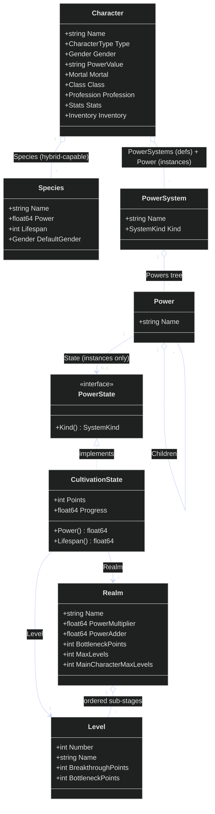

# Domain Model

> Slice/collection fields are shown with `*` multiplicity on the relationships
> rather than `[]` in the boxes (Mermaid class members don't take Go's `[]T`).

The center of gravity is the **Character** and the **progression** vocabulary it
draws on. A `PowerSystem` is a named tree of `Power` nodes; a `Realm` is a
cultivation stage whose `Power`/`Lifespan` follow linear `ax + b` formulas and which
is subdivided into ordered `Level`s carrying the breakthrough/bottleneck thresholds.
The key polymorphism is `PowerState`: a `Power` node's optional per-character progress,
implemented today by `CultivationState` (anchored to a `Realm` + `Level`) and, later,
by other system kinds (e.g. Magic) without changing `Power` or `PowerSystem`. RPG
building blocks (`Class`, `Profession`, `Stats`, `Inventory`) and the cosmology and
novel contexts hang off this core — see the other diagrams for those. Note the two
distinct roles the same `PowerSystem` type plays on a character (definitions in
`PowerSystems`, instances in `Power`), detailed next in
[character-power.md](character-power.md).
