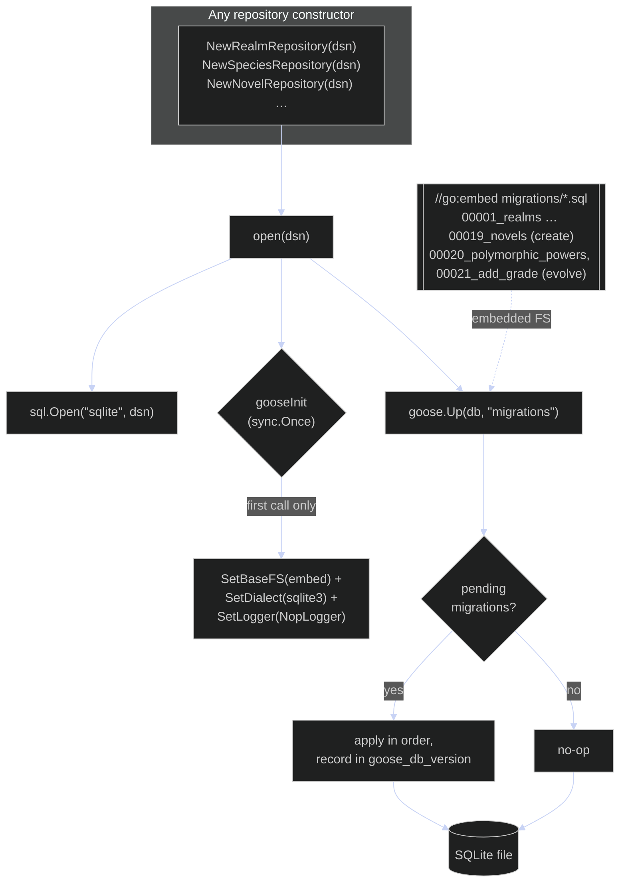

# Persistence & Migrations (goose)

> This covers the **SQLite** half of persistence. `Character` and `PowerSystem` do not
> live here — they are serialized as JSON aggregates by `adapter/file` and involve no
> schema at all. See [classes-adapters.md](classes-adapters.md) and
> [../decisions.md](../decisions.md) §3.

Schema is managed with **goose v3 as an embedded library**, not a CLI. The migration
SQL files live in `internal/adapter/sqlite/migrations/*.sql` (goose `-- +goose Up` /
`-- +goose Down` format) and are compiled into the binary via `//go:embed`, so it ships
self-contained. Every repository constructor calls `open(dsn)`, which opens the database
and runs `goose.Up`; goose's global config (embedded FS, `sqlite3` dialect, and a
**`NopLogger`** so migration output never leaks into CLI stdout) is set exactly once via
a `sync.Once`. `goose.Up` is **idempotent** — it records applied versions in the
`goose_db_version` table, so the many constructors that each call `open` are safe and
subsequent opens are no-ops.

Migrations are **one per entity**, numbered in dependency order: `00001_realms.sql`
through `00019_novels.sql` create the tables, and the `Up` blocks keep
`CREATE TABLE IF NOT EXISTS` so a database made by the earlier hand-rolled bootstrap
adopts migrations cleanly. `00020_polymorphic_powers.sql` and `00021_add_grade.sql` then
*evolve* existing tables with `ALTER TABLE` — exactly what the old bootstrap could not do.
Further changes go into the next numbered file.

Some of that schema is now **dead**: `00002_power_systems.sql` (`power_systems`, `powers`),
`00004_characters.sql` (`characters`, `character_stats`, `character_systems`,
`character_items`, `character_cultivations`) and `00020`'s `character_superpowers` are still
created and migrated, but nothing reads or writes them since characters and power systems
moved to the `file` adapter. They await a drop migration. See
[../architecture.md](../architecture.md#database-migrations).
