# Flow: Train a Node, Idle, Pass Time, Render Status

```mermaid
%%{init: {"theme":"dark","themeVariables":{"lineColor":"#c8d3f5"},"themeCSS":".edgePath path,.flowchart-link{stroke-width:2px} .messageLine0,.messageLine1{stroke-width:2px} .relation{stroke-width:2px} .actor{stroke-width:2px} .node rect,.node circle,.node polygon,.node path{stroke-width:2px} .cluster rect{stroke-width:2px}"}}%%
sequenceDiagram
    actor User
    participant CLI as cli.App
    participant CS as CharacterService
    participant IS as IdleService
    participant PSR as PowerSystemRepository (file)
    participant Repo as CharacterRepository (file)

    rect rgb(31,42,68)
    note over User,Repo: 1 — unlock a node
    User->>CLI: tge character train-node --name "Lin Feng" --system Cultivation --node spirit
    CLI->>CS: TrainNode({Character, System, NodeID})
    CS->>Repo: FindByName
    CS->>PSR: FindByName(system) → PowerSystem (DAG)
    CS->>CS: node exists? not already unlocked?
    CS->>CS: all node.Parents unlocked?
    CS->>CS: no unlocked node in node.MutuallyExclusive?
    CS->>CS: append NodeProgress{Level:1, Progress:100, BasePower}
    CS->>CS: CalculateTotalPower()
    CS->>Repo: Save
    CS-->>CLI: Character
    CLI-->>User: [Ding! Training complete!] Power is now <recomputed>
    end

    rect rgb(46,38,20)
    note over User,Repo: 2 — assign a background activity
    User->>CLI: tge character idle --name "Lin Feng" --system Cultivation --power spirit --time 24
    CLI->>CS: AssignIdleActivity(name, system, power, hours)
    CS->>IS: AssignActivity(...)
    IS->>Repo: FindByName
    IS->>IS: CommitOfflineGains(char) — settle what is already running
    IS->>IS: len(Slots) < TotalSlots?
    IS->>IS: append IdleSlot{StartTime: NovelTime, Duration, Rate: 10/hr}
    IS->>Repo: Save
    IS-->>CLI: Character
    CLI-->>User: idling "Cultivation": "spirit" for 24 hour(s)
    end

    rect rgb(22,53,31)
    note over User,Repo: 3 — advance the in-story clock
    User->>CLI: tge character pass-time --name "Lin Feng" --days 2
    CLI->>CS: PassTime(name, 172800)
    CS->>Repo: FindByName
    CS->>CS: NovelTime += seconds
    CS->>IS: CommitOfflineGains(&char)
    activate IS
    IS->>IS: elapsed hours × Rate → points
    IS->>IS: char.AdvanceNode(system, power, points)
    note over IS: NodeProgress.Advance fills 100×Level²,<br/>levels up, returns the remainder
    IS->>IS: leftover (only if node not unlocked) → EnergyPools
    IS->>IS: expire finished slots, re-stamp running ones
    deactivate IS
    CS->>Repo: Save
    CLI-->>User: passed 172800 seconds. Current NovelTime: 172800
    end

    rect rgb(48,28,44)
    note over User,Repo: 4 — read it back
    User->>CLI: tge status
    CLI->>CS: MainCharacter(ctx)
    CLI->>PSR: GetSystem for each of char.Systems
    CLI->>CLI: roots = nodes with no Parents
    CLI->>CLI: CurrentEnergyPools(NovelTime) — projection, no mutation
    CLI-->>User: Power / per-system roots / Nodes / Idle Slots / Points
    end
```

Progression is a four-command story that crosses separate processes, so every step
persists the whole character aggregate as JSON.

**`train-node` unlocks; it does not train.** It walks the DAG guards — the node exists in
the system, the character hasn't already unlocked it, *every* node in `Parents` is already
unlocked, and nothing in `MutuallyExclusive` is — and then grants the node outright at
`Level 1` / `Progress 100`. Because it refuses a node that is already unlocked, it cannot be
called twice; levels beyond 1 only come from idle accrual.

**Idle runs on `NovelTime`, not wall-clock time.** A slot is stamped with the character's
in-story clock and produces `Rate` points per elapsed *hour* (hard-coded to `10.0`). Nothing
happens until `pass-time` moves the clock, which makes the whole simulation deterministic
and replayable — the same commands always yield the same character. A `--time` of `0` or
less means indefinite; those slots are re-stamped to the current `NovelTime` on every commit
so they accrue continuously without unbounded catch-up.

**Two reads of "how much has idling produced", and they disagree.**
`IdleService.CommitOfflineGains` is the **write** path: it converts elapsed hours to points,
pours them through `Character.AdvanceNode` (which finds the matching `NodeProgress` and calls
`Advance`, filling the `100 × Level²` gate and levelling up), banks only the *remainder* into
`MechanicState.EnergyPools` under `"<system>_<power>"`, and expires finished slots.
`Character.CurrentEnergyPools(now)` is the non-mutating **projection** `tge status` uses —
but it adds `elapsed × Rate` **straight to the pool**, with no `AdvanceNode` step, so it
reports as banked points what a commit would have spent on node progress.

That divergence never actually surfaces, because the projection's slot term is dead in
practice: the only thing that moves `NovelTime` is `pass-time`, which commits before saving,
and a commit re-stamps every surviving slot to `StartTime = NovelTime`. By the time `status`
runs, `now > slot.StartTime` is false for every slot and the loop contributes `0` — so
`status` only ever displays the already-committed `MechanicState.EnergyPools`.

The remainder branch, likewise, only fires when the slot names a node the character has
**not** unlocked: `AdvanceNode` hands every point straight back and all of it lands in the
pool. For an unlocked node, `Advance` loops until the points are spent, so nothing is left
over. Either way the pool is currently a dead end — nothing spends it.

One more arithmetic quirk: `train-node` leaves a node at `Progress 100`, which is *exactly*
the level-1 gate (`100 × 1²`), so the first `Advance` promotes it to Level 2 before consuming
a single point. See [../decisions.md](../decisions.md) §4 and §9.
